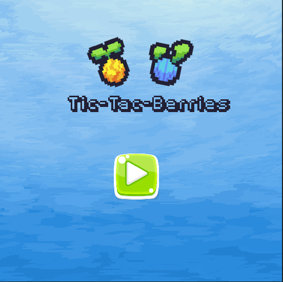
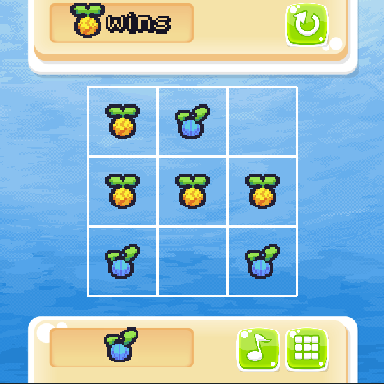

# Tic-Tac-Berries
A tic-tac-toe game but with berries instead of X and O, (I am not sure if those are berries tho)

## Screenshots
|Menu|Ingame|
|---|---|
|||

## Downloading and playing
### Dependencies
Install `pygame` using : 
```bash
$ pip3 install pygame
```
### Usage
First clone the repo locally using :
```bash
$ git clone https://github.com/hopeful-lemon/tic-tac-berries.git
```
then run the `main.py` file
```bash
$ cd tic-tac-berries
$ python3 src/main.py
```